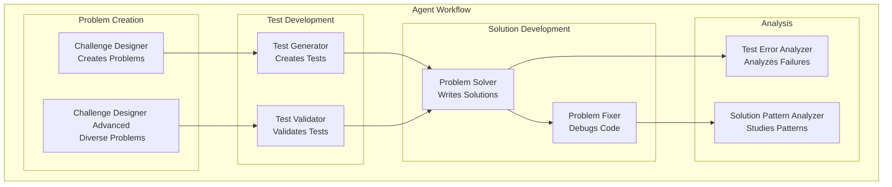
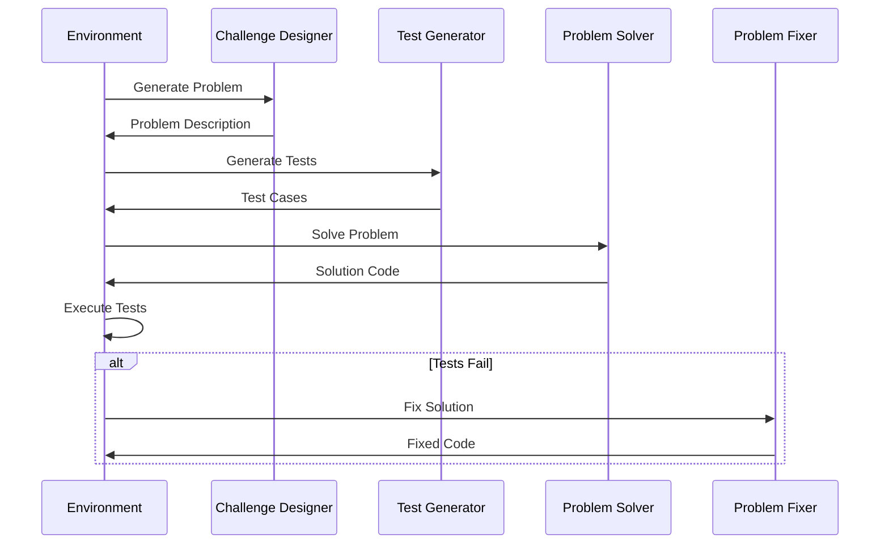
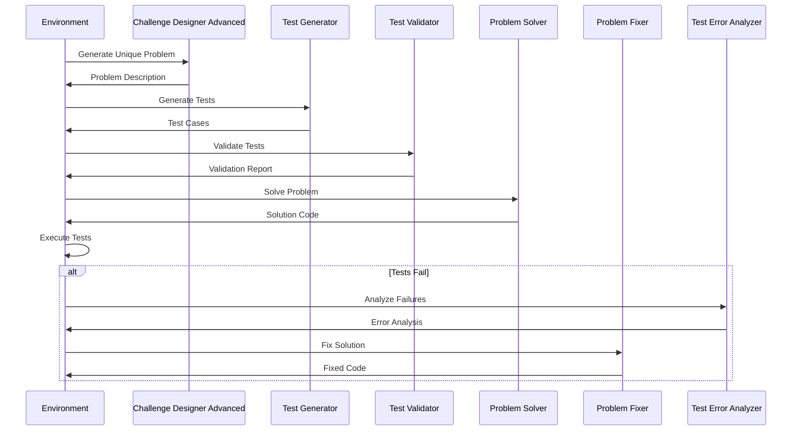

# Agent System

The agent system is the heart of PrismBench's evaluation methodology. It uses specialized agents to orchestrate complex multi-step evaluations that mirror real-world software development workflows.

## Agent Architecture

### Overview

PrismBench employs a **multi-agent architecture** where specialized agents collaborate to create, evaluate, and analyze coding challenges. Each agent has a specific role, expertise area, and set of responsibilities.



### Design Principles

#### 1. **Specialization**
Each agent is designed for a specific task with:
- Domain-specific expertise
- Tailored prompts and instructions
- Optimized output formats
- Task-appropriate model parameters

#### 2. **Collaboration**
Agents work together in defined workflows:
- Sequential processing pipelines
- Information passing between agents
- Error handling and recovery
- Quality assurance checkpoints

#### 3. **Modularity**
Agents are independently configurable:
- Swappable implementations
- Adjustable parameters
- Custom prompt templates
- Provider-agnostic design

#### 4. **Consistency**
Standardized interaction patterns:
- Common configuration format
- Uniform output formatting
- Consistent error handling
- Predictable behavior

## Agent Roles and Responsibilities

### 1. Challenge Designer (`challenge_designer`)

**Purpose**: Creates coding problems focused on specific CS concepts and difficulty levels.

**Key Responsibilities**:
- Generate problem statements similar to LeetCode challenges
- Ensure problems match specified concepts and difficulty
- Provide clear input/output specifications
- Include comprehensive examples and constraints
- Explain concept relevance

**Input Requirements**:
- `concepts`: List of CS concepts to test
- `difficulty_level`: Target difficulty (very easy to very hard)

**Output Format**:
```xml
<problem_description>
## Problem Title
Difficulty: [Level]

[Problem description with input/output specs, constraints, examples]
</problem_description>
```

**Configuration Example**:
```yaml
role: challenge_designer
model_name: gpt-4o-mini
model_provider: openai
api_base: https://api.openai.com/v1/
model_params:
  temperature: 0.8  # High creativity for diverse problems
  max_tokens: 5120
system_prompt: >
  You are an expert computer science educator specializing in creating 
  coding challenges...
```

### 2. Challenge Designer Advanced (`challenge_designer_advanced`)

**Purpose**: Creates diverse, unique coding problems while avoiding duplication.

**Key Differentiators**:
- **Duplicate Avoidance**: Analyzes previous problems to ensure uniqueness
- **Variation Generation**: Creates substantially different problem approaches
- **Context Diversity**: Uses different scenarios and problem contexts
- **Advanced Constraints**: Implements more complex requirement patterns

**Input Requirements**:
- `concepts`: CS concepts to test
- `difficulty_level`: Target difficulty
- `previous_problems`: List of previously generated problems to avoid

**Advanced Features**:
- Problem similarity analysis
- Context variation (different domains, scenarios)
- Approach diversification (different algorithmic strategies)
- Constraint variation (different input/output patterns)

### 3. Test Generator (`test_generator`)

**Purpose**: Develops comprehensive unittest test cases for coding problems.

**Key Responsibilities**:
- Create test classes inheriting from `unittest.TestCase`
- Cover scenarios from very easy to very hard
- Include edge cases and boundary conditions
- Provide descriptive test method names and docstrings
- Use appropriate assertions for result verification

**Test Coverage Strategy**:
- **Basic functionality**: Core problem requirements
- **Edge cases**: Boundary values and special conditions
- **Error handling**: Invalid inputs and error conditions
- **Performance**: Large inputs and stress testing
- **Corner cases**: Unusual but valid scenarios

**Output Format**:
```python
<test_code>
import unittest

class TestFunction(unittest.TestCase):
    def test_basic_case(self):
        """Test basic functionality."""
        self.assertEqual(function_to_test([1,2,3]), expected_result)
    
    def test_edge_case(self):
        """Test edge cases."""
        self.assertEqual(function_to_test([]), expected_edge_result)
</test_code>
```

### 4. Test Validator (`test_validator`)

**Purpose**: Validates test case quality and coverage.

**Validation Criteria**:
- **Coverage Analysis**: Ensures all problem requirements are tested
- **Edge Case Verification**: Confirms comprehensive edge case testing
- **Assertion Correctness**: Validates test expectations
- **Test Structure**: Checks test organization and naming
- **Quality Assessment**: Evaluates test effectiveness

**Output Format**:
```xml
<test_validation>
1. Missing Test Scenarios:
   - [List of missing test cases]

2. Incorrect Assertions:
   - [Issues with test expectations]

3. Suggestions for Improving Test Coverage:
   - [Recommendations for better coverage]

4. Analysis of Edge Cases:
   - [Edge case analysis and recommendations]
</test_validation>
```

### 5. Problem Solver (`problem_solver`)

**Purpose**: Implements efficient, well-structured solutions to coding problems.

**Key Responsibilities**:
- Develop algorithmic solutions
- Write clean, commented code
- Handle all specified constraints
- Optimize for time and space complexity
- Provide single `solution` function

**Solution Requirements**:
- Function named `solution`
- Handles all input specifications
- Returns output as specified
- Includes clear comments
- Follows Python best practices

**Output Format**:
```python
<generated_solution>
def solution(input_params):
    """
    Clear description of the approach and complexity.
    
    Args:
        input_params: Description of inputs
        
    Returns:
        Description of output
    """
    # Implementation with clear comments
    pass
</generated_solution>
```

### 6. Problem Fixer (`problem_fixer`)

**Purpose**: Analyzes failing solutions and provides corrected versions.

**Debugging Process**:
1. **Error Analysis**: Identify specific failure points
2. **Root Cause Analysis**: Determine underlying issues
3. **Solution Strategy**: Plan correction approach
4. **Code Repair**: Implement fixes
5. **Verification**: Ensure fixes address all issues

**Input Requirements**:
- `problem_statement`: Original problem description
- `test_cases`: Test cases that are failing
- `current_solution`: Current failing solution
- `error_output`: Detailed error information

**Analysis Areas**:
- Logic errors and algorithm issues
- Edge case handling problems
- Performance and efficiency issues
- Syntax and runtime errors
- Test requirement misunderstandings

### 7. Test Error Analyzer (`test_error_analyzer`)

**Purpose**: Provides detailed analysis of test execution failures.

**Analysis Categories**:
- **Test Failures**: Specific tests that didn't pass
- **Error Analysis**: Runtime errors and exceptions
- **Root Cause Identification**: Underlying problem causes
- **Improvement Suggestions**: Recommendations for fixes

**Output Format**:
```xml
<error_analysis>
Test Failures:
1. [test_name]:
   Failure Reason: [detailed explanation]
   Root Cause: [underlying issue]

Test Errors:
1. [test_name]:
   Error Reason: [error details]
   Root Cause: [error source]

Root Causes:
- [List of identified root causes]

Suggested Areas to Investigate:
- [Specific recommendations for investigation]
</error_analysis>
```

### 8. Solution Pattern Analyzer (`solution_pattern_analyzer`)

**Purpose**: Analyzes solution code to identify patterns and implementation approaches.

**Analysis Dimensions**:
- **Algorithm Patterns**: Strategic approaches used
- **Data Structure Usage**: Choice and application of data structures
- **Code Organization**: Structure and modularity patterns
- **Implementation Choices**: Language features and techniques
- **Performance Characteristics**: Complexity and optimization patterns

**Output Format**:
```json
<pattern_analysis>
{
  "algorithm_patterns": {
    "main_strategy": "dynamic programming",
    "time_complexity": "O(n^2)",
    "space_complexity": "O(n)"
  },
  "data_structures": {
    "primary": ["hashmap", "array"],
    "usage_patterns": {
      "hashmap": "O(1) lookups for memoization"
    }
  },
  "implementation_choices": {
    "language_features": ["list comprehension"],
    "optimization_techniques": ["early termination"]
  }
}
</pattern_analysis>
```

## Agent Configuration System

### Configuration Structure

Each agent is defined by a YAML configuration file with four main sections:

```yaml
role: [unique_identifier]
model_name/model_provider/api_base: [provider settings]
model_params: [optional generation settings]
system_prompt: [role definition and instructions]
interaction_templates: [input/output templates]
```

### Model Configuration

Agents can use different models optimized for their tasks:

```yaml
model_name: gpt-4o-mini      # Model selection
model_provider: openai       # Provider choice
api_base: https://api.openai.com/v1/
model_params:
  temperature: 0.8           # Creativity level
  max_tokens: 5120           # Response length
```

### Prompt Engineering

System prompts define agent expertise and behavior:

```yaml
system_prompt: >
  You are an expert [domain] specialist with expertise in [areas].
  Your role is to [specific responsibilities].
  
  When given [inputs], you should [expected actions].
  
  Your response should include [output requirements].
  
  **IMPORTANT:** [critical formatting requirements]
```

### Interaction Templates

Templates define how agents receive inputs and format outputs:

```yaml
interaction_templates:
  basic:
    inputs:
      - name: input1
        type: str
        description: First input field
      - name: input2
        type: str
        description: Second input field
    outputs:
      - name: response
        type: str
        description: Agent output
```

## Agent Workflows

### Standard Workflow (`environment_coding_challenge`)

Sequential agent pipeline for basic evaluation:



### Enhanced Workflow (`environment_enhanced_coding_challenge`)

Extended pipeline with validation and analysis:



## Agent Communication

### Session Management

Agents communicate through the LLM Interface Service:

1. **Request Submission**: Call `POST /interact` with `session_id`, `role`, and `input_data`
2. **Template Resolution**: LLM Interface selects the matching interaction template by input keys
3. **Synchronous Response**: Receive `{message, session_id}` directly
4. **History Access**: Inspect role history via `GET /session_history/{session_id}`
5. **Session Cleanup**: Remove stored session data via `DELETE /session/{session_id}`

### Input/Output Formatting

Standardized communication format:

```python
# Input to agent
{
    "session_id": "uuid",
    "role": "challenge_designer",
    "input_data": {
        "concepts": ["loops", "arrays"],
        "difficulty_level": "medium",
        # ... other template parameters
    },
    "use_agent": False
}

# Output from agent
{
    "message": "[agent response text]",
    "session_id": "uuid"
}
```

### Error Handling

Robust error handling at multiple levels:

- **Input Validation**: Check required parameters
- **Model Errors**: Handle API failures and timeouts
- **Output Parsing**: Validate response format

## Advanced Agent Features

### Dynamic Model Selection

Agents can be configured with different models for different tasks:

```yaml
# High creativity for problem generation
challenge_designer:
  model_params:
    temperature: 0.8
    
# Low temperature for code generation
problem_solver:
  model_params:
    temperature: 0.2
```

### Custom Agent Templates

Create domain-specific agents:

```yaml
role: security_analyst
model_name: gpt-4o-mini
model_provider: openai
api_base: https://api.openai.com/v1/
system_prompt: >
  You are a cybersecurity expert specializing in code security analysis...
interaction_templates:
  security_review:
    inputs:
      - name: code
        type: str
        description: Source code to review
      - name: security_requirements
        type: str
        description: Security requirements
    outputs:
      - name: response
        type: str
        description: Security review report
```

### Agent Composition

Combine agents for complex workflows:

```yaml
custom_environment:
  agents:
    - challenge_designer
    - security_analyst
    - performance_analyzer
    - problem_solver
    - code_reviewer
```

## Performance Optimization

### Concurrent Execution

Multiple agents can run concurrently:
- Independent task processing
- Parallel test execution
- Async communication patterns
- Resource management

### Caching Strategies

Optimize repeated operations:
- Session reuse for similar tasks
- Connection pooling

---

**Next Steps:**
- [Environment System](Environment-System) - How agents work within environments
- [Configuration Overview](Configuration-Overview) - Detailed configuration guide
- [Custom Agents](Custom-Agents) - Creating new agent types
- [Extending PrismBench](Extending-PrismBench) - Agent usage examples

---

## Related Pages

### **Agent Development**
- [Custom Agents](Custom-Agents) - Creating specialized agents with custom prompts
- [Custom Environments](Custom-Environments) - Agent orchestration in environments
- [Extension Combinations](Extension-Combinations) - Combining agents with other extensions

### **System Integration**
- [Environment System](Environment-System) - How agents work within environments
- [Architecture Overview](Architecture-Overview) - Overall system design
- [Configuration Overview](Configuration-Overview) - Agent configuration system

### **Implementation**
- [Extending PrismBench](Extending-PrismBench) - Framework extension overview
- [Results Analysis](Results-Analysis) - Understanding agent performance
- [Troubleshooting](troubleshooting) - Agent-related issues and solutions 
