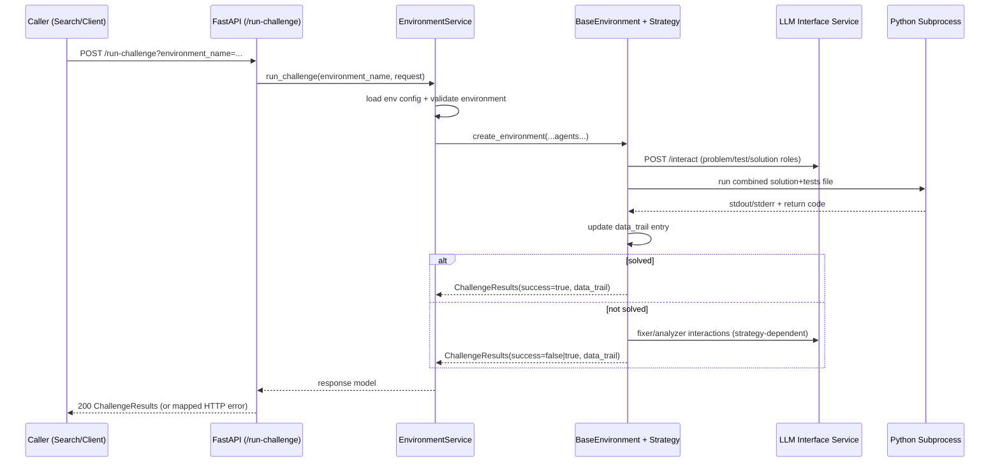

# Environment Service

[](https://fastapi.tiangolo.com/)
[](https://python.org)
[](https://docker.com)
[](#execution-and-artifact-model)

The Environment Service is PrismBench's challenge execution runtime. It exposes a stable HTTP API for running coding challenges through environment strategies, coordinates role-based LLM calls via the LLM Interface service, executes generated code against generated tests, and returns attempt-level traces used by Search/MCTS scoring.

## Table of Contents

- [Why This Service Exists](#why-this-service-exists)
- [Service Responsibilities](#service-responsibilities)
- [How a Request Flows](#how-a-request-flows)
- [API Reference](#api-reference)
- [Execution and Artifact Model](#execution-and-artifact-model)
- [Environment Configuration Contract](#environment-configuration-contract)
- [Configuration and Environment Variables](#configuration-and-environment-variables)
- [Run and Test Locally](#run-and-test-locally)
- [Run with Docker Compose](#run-with-docker-compose)
- [Extending with Custom Environments](#extending-with-custom-environments)
- [Operational Notes](#operational-notes)
- [Troubleshooting](#troubleshooting)
- [Code Map](#code-map)

## Why This Service Exists

In PrismBench, Search discovers what to evaluate, but it needs a dedicated execution service to actually run challenges and produce structured outcomes. This service centralizes that execution concern and provides:

- One API contract (`POST /run-challenge`) for all challenge execution requests.
- Strategy-based environment behavior (`environment_coding_challenge`, `environment_enhanced_coding_challenge`, custom environments).
- Multi-agent orchestration through the LLM Interface service instead of direct provider calls.
- Deterministic attempt tracing (`data_trail`) for downstream scoring and analysis.
- Isolated per-request code execution artifacts.

Without this service, each caller would have to duplicate environment selection, agent/session coordination, subprocess execution, and result normalization.

## Service Responsibilities

This service does:

- Accept challenge execution requests via FastAPI.
- Validate and route requests to registered environment strategies.
- Load environment definitions from `configs/environment_config.yaml`.
- Initialize role-specific LLM interface clients for configured agents.
- Run generated Python solution + test bundles in subprocesses.
- Parse execution output into `tests_passed_num`, `tests_failed_num`, and `tests_errored_num`.
- Return full attempt history in `ChallengeResults`.

This service does not:

- Run search logic or MCTS orchestration (Search service does this).
- Talk directly to OpenAI/Anthropic/etc. (LLM Interface service does this).
- Persist benchmark datasets/results as a data platform.
- Enforce authn/authz by default.

## How a Request Flows



## API Reference

Interactive docs when running locally:

- Swagger: [http://localhost:8001/docs](http://localhost:8001/docs)
- ReDoc: [http://localhost:8001/redoc](http://localhost:8001/redoc)

### `GET /`

Returns service metadata and links:

```json
{
  "message": "PrismBench - Environment Service - Alive",
  "documentation": "/docs",
  "redoc": "/redoc",
  "health": "/health"
}
```

### `GET /health`

Process-level health endpoint:

```json
{
  "status": "healthy",
  "service": "environment"
}
```

### `POST /run-challenge`

Primary execution endpoint.

Query parameter:

- `environment_name` (optional): defaults to `environment_coding_challenge`.

Request body:

```json
{
  "concept": "dynamic programming",
  "difficulty_level": "medium",
  "max_attempts": 3,
  "previous_problems": ["Two Sum Variants"]
}
```

Request semantics:

- `concept` accepts either a single string or a list of strings.
- `difficulty_level` is forwarded directly to environment agents.
- `max_attempts` overrides the environment default when provided.
- `previous_problems` is primarily relevant for enhanced environment prompt context.

Response model:

```json
{
  "success": true,
  "data_trail": [
    {
      "attempt_num": 0,
      "problem_statement": "...",
      "test_cases": "...",
      "solution_code": "...",
      "success": true,
      "output": "All tests passed.",
      "tests_passed_num": 5,
      "tests_failed_num": 0,
      "tests_errored_num": 0,
      "fixed_by_problem_fixer": false,
      "error_feedback": null,
      "test_validation": null,
      "test_error_analysis": null
    }
  ]
}
```

`data_trail` field meanings:

- `attempt_num`: zero-based attempt index (final fixer attempt appears as an additional entry).
- `problem_statement`: generated challenge text.
- `test_cases`: generated tests after function-name normalization to `solution`.
- `solution_code`: candidate/fixed code executed for this attempt.
- `success`: attempt-level pass/fail.
- `output`: raw subprocess output used for diagnostics and error-feedback prompts.
- `tests_passed_num` / `tests_failed_num` / `tests_errored_num`: parsed test outcome counts.
- `fixed_by_problem_fixer`: set to `true` when final fixer attempt succeeds.
- `error_feedback`: feedback prompt passed to solver on iterative retries.
- `test_validation`: enhanced environment validator output (populated on successful solve path).
- `test_error_analysis`: enhanced environment analyzer output (fixer path).

Common error cases:

- `500`: unknown environment name, missing environment agents/config, strategy execution failures.
- `400`: only used if `ValidationException` is raised (not common in current flow).
- `500` with `"Internal server error"`: unexpected uncaught exception in endpoint handler.

## Execution and Artifact Model

Each `run_challenge` call creates a new `BaseEnvironment` instance with:

- A new `challenge_id` UUID.
- A dedicated output directory: `ENV_OUTPUT_DIR/<challenge_id>/`.
- A `ProcessPoolExecutor` for subprocess script execution.

Per attempt:

- Service writes a unique file: `attempt_<attempt>_<uuid>_combined_code.py`.
- File content is `solution_code + "\n" + test_cases`.
- Script is executed with `python <script_path>`.
- Return code/output are mapped to success and test count metrics.

Cleanup behavior:

- `reset()` closes remote LLM interface sessions for all agents.
- Object destructor shuts down process pool and removes files/directories.
- On some early-return failure paths in environment strategies, `reset()` is skipped, so remote sessions may remain until separately deleted.

## Environment Configuration Contract

Environment definitions live in `configs/environment_config.yaml`.

Each top-level key is an environment name (must match registered strategy name).

Supported fields (via `EnvironmentConfig`):

- `agents` (required): ordered list of role names used to instantiate `InterfaceClient`s.
- `max_attempts` (optional, default `3`): retry budget for generation/solve loops.
- `timeout` (optional, default `300`): modeled in config but not currently wired to `InterfaceClient`.
- `num_problems` (optional, default `1`): forwarded when `>1`, but built-in strategies currently execute one problem per request.
- Additional custom keys are accepted (`extra = "allow"`), enabling custom environment-specific params.

Current repository configuration:

```yaml
environment_coding_challenge:
  agents:
    - "challenge_designer"
    - "test_generator"
    - "problem_solver"
    - "problem_fixer"
  max_attempts: 3
  timeout: 300
  num_problems: 1

environment_enhanced_coding_challenge:
  agents:
    - "challenge_designer_advanced"
    - "test_generator"
    - "problem_solver"
    - "problem_fixer"
    - "test_validator"
    - "test_error_analyzer"
  max_attempts: 3
  timeout: 600
  num_problems: 5
```

### Built-in environment behavior

`environment_coding_challenge`:

- Agents: `challenge_designer`, `test_generator`, `problem_solver`, `problem_fixer`.
- Flow: problem generation -> test generation -> iterative solving -> final fixer attempt.

`environment_enhanced_coding_challenge`:

- Agents: `challenge_designer_advanced`, `test_generator`, `test_validator`, `problem_solver`, `problem_fixer`, `test_error_analyzer`.
- Adds test validation and failure analysis around the standard flow.
- Uses `previous_problems` context to reduce duplication during problem generation.

Environment registration rules:

- Strategy modules must be named `environment_*.py` under `src/environment/`.
- Methods are registered via `@environment_registry.register_environment_method("<name>", "execute_node")`.
- `EnvironmentRegistry.load_environment_modules()` auto-imports matching modules to register strategies.

## Configuration and Environment Variables

| Variable | Required | Default | Purpose |
| --- | --- | --- | --- |
| `LLM_SERVICE_URL` | No | `http://llm-interface:8000` | Base URL for outbound role interactions (`/interact`, `/session/{id}`) |
| `ENV_OUTPUT_DIR` | No | `/app/env_outputs` | Root directory for per-request generated execution files |
| `PYTHONPATH` | Deployment-dependent | none | Module resolution in container/local runtime |

Configuration file requirements:

- `configs/environment_config.yaml` must exist relative to process working directory.
- Service startup succeeds without it, but first request that resolves settings will fail with `FileNotFoundError`.

## Run and Test Locally

Commands below assume repository root as current working directory.

1. Ensure the LLM Interface dependency is reachable (for example, start `redis` and `llm-interface` with Docker Compose).

```bash
docker compose -f docker/docker-compose.yaml up --build redis llm-interface
```

2. Install Environment service dependencies.

```bash
cd src/services/environment
uv pip install -e .
cd ../../..
```

3. Start the Environment API from repository root.

```bash
export LLM_SERVICE_URL=http://localhost:8000
uvicorn src.services.environment.src.main:app --host 0.0.0.0 --port 8001 --reload
```

4. Verify liveness.

```bash
curl http://localhost:8001/health
```

### Quick functional check

```bash
curl -s "http://localhost:8001/run-challenge?environment_name=environment_coding_challenge" \
  -X POST \
  -H "Content-Type: application/json" \
  -d '{
    "concept": "two pointers",
    "difficulty_level": "easy",
    "max_attempts": 2
  }' | jq .
```

## Run with Docker Compose

From repository root:

```bash
docker compose -f docker/docker-compose.yaml up --build node-env
```

The compose stack for this service:

- Builds from `src/services/environment/Dockerfile`.
- Mounts repository `configs/` into `/app/configs`.
- Mounts service source into `/app/src` for iterative development.
- Exposes the service at `http://localhost:8001` (`container:8000`).
- Sets `LLM_SERVICE_URL=http://llm-interface:8000`.

## Extending with Custom Environments

1. Add a strategy module under `src/environment/` (for example `environment_custom.py`).
2. Register `execute_node` using the environment registry decorator.
3. Add matching config entry in `configs/environment_config.yaml`.
4. Call `/run-challenge?environment_name=environment_custom`.

Minimal custom strategy:

```python
from typing import TYPE_CHECKING, Dict

from .environment_registry import environment_registry

if TYPE_CHECKING:
    from .base_environment import BaseEnvironment


@environment_registry.register_environment_method("environment_custom", "execute_node")
async def execute_node(self: "BaseEnvironment", concept: str, difficulty_level: str, **kwargs) -> Dict:
    if not self._initialized:
        await self.initialize()

    message = await self.agents["challenge_designer"].interact(
        concepts=concept,
        difficulty_level=difficulty_level,
    )
    await self.reset()

    return {"success": bool(message), "data_trail": []}
```

## Operational Notes

- CORS is currently open (`*`) for origins, methods, and headers.
- Service executes generated Python code in subprocesses; deploy only inside restricted runtime boundaries.
- `/health` checks API process liveness only, not end-to-end dependency health.
- `InterfaceClient.clear_memory()` exists but the current LLM Interface API does not expose a matching endpoint; the Environment service uses session close (`DELETE /session/{id}`) instead.
- Settings are loaded/cached with `lru_cache`, so config file changes require process restart to guarantee refresh.

## Troubleshooting

### `500` with "Environment '...' not found"

Most common cause is mismatch between requested `environment_name` and registered strategy names.

Confirm:

- Module file follows `environment_*.py` naming.
- Decorator uses the same environment name you request.
- Module is in `src/environment/` so auto-discovery can import it.

### `500` due missing environment config or agents

Confirm:

- `configs/environment_config.yaml` exists from the process working directory.
- Requested environment has an `agents` list.
- Agent role names match configured roles in LLM Interface service.

### Frequent failed attempts with empty outputs

Check:

- `LLM_SERVICE_URL` points to reachable LLM Interface instance.
- Role configs are available in LLM Interface for every role used by this environment.
- Returned `data_trail[*].output` for syntax/runtime errors in generated code.

### File/permission errors under `ENV_OUTPUT_DIR`

Ensure the runtime user can create, write, and delete directories/files under the configured output root.

## Code Map

```text
src/services/environment/
├── src/main.py                                   # FastAPI app bootstrap + CORS + root route
├── src/api/v1/router.py                          # Route aggregation
├── src/api/v1/endpoints/challenges.py            # /run-challenge
├── src/api/v1/endpoints/health.py                # /health
├── src/services/environment_service.py           # Runtime orchestration + environment selection
├── src/environment/base_environment.py           # Shared environment runtime (agents, pool, dispatch, reset)
├── src/environment/environment_registry.py       # Discovery + strategy registration
├── src/environment/environment_coding_challenge.py
│                                                  # Standard challenge strategy
├── src/environment/environment_enhanced_coding_challenge.py
│                                                  # Enhanced strategy with validation + analysis
├── src/environment/utils.py                      # Script execution + helper utilities
├── src/interface_client.py                       # LLM Interface HTTP client wrapper
├── src/models/requests.py                        # Request schemas
├── src/models/responses.py                       # Response schemas
├── src/models/domain.py                          # Challenge data-trail model
├── src/core/config.py                            # YAML config loading + settings model
├── src/core/dependencies.py                      # FastAPI dependency providers
├── src/core/exceptions.py                        # Domain exceptions + HTTP mapping
├── pyproject.toml                                # Service dependency definition
└── Dockerfile                                    # Container runtime definition
```

For system-level context, see the repository docs in [`docs/`](../../../docs/).
