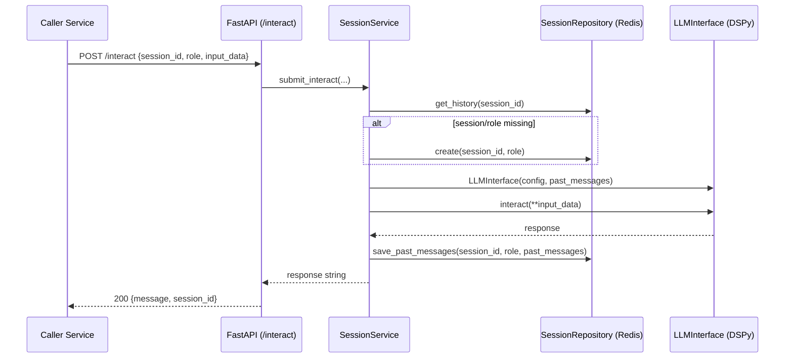

# LLM Interface Service

[](https://fastapi.tiangolo.com/)
[](https://python.org)
[](https://redis.io/)
[](https://dspy.ai/)

The LLM Interface Service is PrismBench's role-based LLM gateway. It exposes a stable HTTP API for multi-turn LLM interactions, loads role definitions from YAML, and persists per-session conversation state in Redis so other microservices can treat LLM calls as a stateful service instead of ad-hoc prompt code.

## Table of Contents

- [Why This Service Exists](#why-this-service-exists)
- [Service Responsibilities](#service-responsibilities)
- [How a Request Flows](#how-a-request-flows)
- [API Reference](#api-reference)
- [Session and Storage Model](#session-and-storage-model)
- [Agent Configuration Contract](#agent-configuration-contract)
- [Configuration and Environment Variables](#configuration-and-environment-variables)
- [Run and Test Locally](#run-and-test-locally)
- [Run with Docker Compose](#run-with-docker-compose)
- [Operational Notes](#operational-notes)
- [Troubleshooting](#troubleshooting)
- [Code Map](#code-map)

## Why This Service Exists

In PrismBench, multiple services need to call LLMs (challenge generation, solving, validation, analysis). This service centralizes that concern and provides:

- One API contract for all LLM interactions.
- Role-specific behavior driven by `configs/agents/*.yaml`.
- Memory continuity across calls via Redis-backed session history.
- Provider abstraction through DSPy (`openai`, `openrouter`, `deepseek`, `togetherai`).

Without this service, each caller would have to duplicate provider setup, prompting, memory handling, and retry/error behavior.

## Service Responsibilities

This service does:

- Accept interaction requests through FastAPI endpoints.
- Lazily create session+role memory on first use.
- Build a DSPy `Predict` signature from agent YAML templates.
- Route requests to the correct template based on input fields.
- Persist role-specific history back to Redis after each call.

This service does not:

- Orchestrate multi-agent workflows end-to-end (handled by higher-level services).
- Validate business semantics of prompt outputs.
- Manage async background job queues.
- Enforce authentication/authorization by default.

## How a Request Flows



## API Reference

Interactive docs when running locally:

- Swagger: [http://localhost:8000/docs](http://localhost:8000/docs)
- ReDoc: [http://localhost:8000/redoc](http://localhost:8000/redoc)

### `GET /`

Returns basic service metadata and links:

```json
{
  "message": "PrismBench - LLM Interface - Alive",
  "documentation": "/docs",
  "redoc": "/redoc",
  "health": "/health"
}
```

### `GET /health`

Process-level health endpoint:

```json
{
  "status": "healthy",
  "service": "llm_interface"
}
```

### `POST /interact`

Primary endpoint for session-based LLM interaction.

Request:

```json
{
  "session_id": "b5773608-070d-437d-8a95-03d9063eafe6",
  "role": "challenge_designer",
  "input_data": {
    "concepts": ["recursion", "dynamic programming"],
    "difficulty_level": "medium"
  },
  "use_agent": false
}
```

Response:

```json
{
  "message": "<LLM output from template response field>",
  "session_id": "b5773608-070d-437d-8a95-03d9063eafe6"
}
```

Important request semantics:

- `session_id` is caller-provided.
- `role` selects `AGENT_CONFIGS_PATH/<role>.yaml`.
- Session/role are auto-created on first request if config exists.
- `input_data` keys must match exactly one interaction template's input names (set equality).
- `use_agent` is currently accepted but not used in runtime logic.

Common error cases:

- `404`: role config file not found for the requested role.
- `500`: template mismatch, unsupported provider, provider/API errors, or unexpected runtime errors.

### `GET /session_history/{session_id}`

Returns role-indexed history for a session:

```json
{
  "session_id": "b5773608-070d-437d-8a95-03d9063eafe6",
  "history": {
    "challenge_designer": {
      "role": "challenge_designer",
      "history": [
        {
          "concepts": ["recursion", "dynamic programming"],
          "difficulty_level": "medium",
          "response": "..."
        }
      ]
    }
  }
}
```

Behavior note: unknown session IDs currently return `200` with an empty `history` object.

### `GET /active_sessions`

Returns raw Redis-backed session hashes for all keys matching `session:*`, including both session metadata keys and per-role history keys.

### `DELETE /session/{session_id}`

Deletes the session key and all role history keys for that session.

Response:

```json
{
  "message": "Session <session_id> deleted"
}
```

If the session does not exist, returns `404`.

## Session and Storage Model

The service stores state in Redis hashes.

Key pattern:

- `session:<session_id>`: session metadata (`session_id`, list of roles)
- `session:<session_id>:<role>`: role-specific conversation history

Example:

```text
session:abc123
session:abc123:challenge_designer
session:abc123:problem_solver
```

Stored payload format:

- Hash field name: `data`
- Hash field value: JSON string serialized from Pydantic models

This design lets one session host multiple independent role histories while sharing the same `session_id`.

## Agent Configuration Contract

Role files live in `AGENT_CONFIGS_PATH` and are resolved by filename:

- Role `challenge_designer` -> `configs/agents/challenge_designer.yaml`
- Role `problem_solver` -> `configs/agents/problem_solver.yaml`

Required top-level keys:

- `role`
- `model_name`
- `model_provider`
- `api_base`
- `system_prompt`
- `interaction_templates`

Optional top-level keys:

- `model_params` (defaults to `{}` if omitted)

Each interaction template must define:

- `inputs`: list of fields with `name`, `description`, optional `type` (defaults to `"str"`)
- `outputs`: list of fields with `name`, `description`, optional `type` (defaults to `"str"`)

Minimal example:

```yaml
role: challenge_designer
model_name: gpt-4o-mini
model_provider: openai
api_base: https://api.openai.com/v1/
model_params:
  temperature: 0.8
  max_tokens: 5120
interaction_templates:
  default:
    inputs:
      - name: concepts
        type: list[str]
        description: List of concepts
      - name: difficulty_level
        type: str
        description: Difficulty value
    outputs:
      - name: response
        type: str
        description: Generated output
system_prompt: >
  Your role instructions...
```

Output contract detail:

- The service returns `output.response` from DSPy.
- In practice, each template should include an output field named `response`.

Provider to env-var mapping used by runtime:

- `openai` -> `OPENAI_API_KEY`
- `openrouter` -> `OPENROUTER_API_KEY`
- `deepseek` -> `DEEPSEEK_API_KEY`
- `togetherai` -> `TOGETHERAI_API_KEY`

## Configuration and Environment Variables

| Variable | Required | Default | Purpose |
| --- | --- | --- | --- |
| `REDIS_URL` | No | `redis://redis:6379` | Redis connection URL for session/history persistence |
| `AGENT_CONFIGS_PATH` | No | `configs/agents` | Directory containing `<role>.yaml` agent configs |
| `OPENAI_API_KEY` | If using `openai` | none | Provider API key |
| `OPENROUTER_API_KEY` | If using `openrouter` | none | Provider API key |
| `DEEPSEEK_API_KEY` | If using `deepseek` | none | Provider API key |
| `TOGETHERAI_API_KEY` | If using `togetherai` | none | Provider API key |

## Run and Test Locally

Commands below assume you run from the repository root.

1. Prepare API keys.

```bash
cp apis.key.template apis.key
set -a
source apis.key
set +a
```

2. Start Redis.

```bash
docker run --rm --name prismbench-redis -p 6379:6379 redis:7
```

3. Install dependencies for the service.

```bash
cd src/services/llm_interface
uv pip install -e .
cd ../../..
```

4. Start the API.

```bash
uvicorn src.services.llm_interface.src.main:app --host 0.0.0.0 --port 8000 --reload
```

5. Verify.

```bash
curl http://localhost:8000/health
```

### Quick functional check

```bash
SESSION_ID=$(uuidgen)

curl -s http://localhost:8000/interact \
  -X POST \
  -H 'Content-Type: application/json' \
  -d "{
    \"session_id\": \"${SESSION_ID}\",
    \"role\": \"challenge_designer\",
    \"input_data\": {
      \"concepts\": [\"hash map\", \"sliding window\"],
      \"difficulty_level\": \"medium\"
    },
    \"use_agent\": false
  }" | jq .

curl -s "http://localhost:8000/session_history/${SESSION_ID}" | jq .
curl -s -X DELETE "http://localhost:8000/session/${SESSION_ID}" | jq .
```

## Run with Docker Compose

From repository root:

```bash
docker compose -f docker/docker-compose.yaml up --build redis llm-interface
```

The compose stack:

- Builds this service from `src/services/llm_interface/Dockerfile`
- Mounts repository `configs/` into `/app/configs`
- Injects secrets from `apis.key`
- Exposes service on `http://localhost:8000`

## Operational Notes

- CORS is currently open (`*`) for origins, methods, and headers.
- Session state has no TTL; Redis keys persist until explicit deletion.
- `/health` checks API liveness only (not Redis/provider connectivity).
- `use_agent` is part of the request model but currently not used in execution.
- History is stored per role; one session can include multiple roles.

## Troubleshooting

### `404` from `/interact`

Most common cause is missing role config file. Confirm:

- Requested `role` matches a file name `<role>.yaml`.
- `AGENT_CONFIGS_PATH` points to the correct directory.

### `500` with template mismatch behavior

`input_data` keys must exactly match one template input set. If your role has:

- `default`: `problem_statement`
- `fix`: `error_feedback`

Then sending both keys (or neither) will fail template selection.

### Redis connection failures

Verify `REDIS_URL` and that Redis is reachable from this service runtime.

### Provider auth/model issues

Verify:

- Correct `model_provider` string in YAML.
- Matching API key environment variable is set.
- `api_base` and `model_name` values are valid for that provider.

## Code Map

```text
src/services/llm_interface/
├── src/main.py                          # FastAPI app bootstrap + CORS + root route
├── src/api/v1/router.py                # Route aggregation
├── src/api/v1/endpoints/               # HTTP endpoints
│   ├── health.py                       # /health
│   ├── interact.py                     # /interact
│   ├── history.py                      # /active_sessions, /session_history/{id}
│   └── sessions.py                     # /session/{id} delete
├── src/services/session_service.py     # Core orchestration between API, repo, LLM
├── src/repositories/session_repo.py    # Redis persistence implementation
├── src/llm/interface.py                # DSPy module wrapper and runtime call logic
├── src/llm/utils.py                    # YAML validation + DSPy signature generation
├── src/models/requests.py              # Request schemas
├── src/models/responses.py             # Response schemas
├── src/models/domain.py                # Session and role-history models
├── src/core/config.py                  # Settings model
├── src/core/dependencies.py            # FastAPI dependency providers
└── src/core/exceptions.py              # Domain exceptions and HTTP mapping
```

For system-level context, see the repository docs in [`docs/`](../../../docs/).
