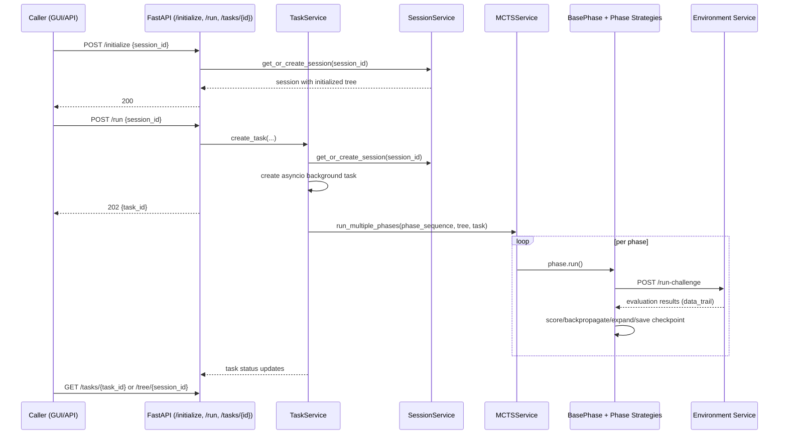

# Search Service

[](https://fastapi.tiangolo.com/)
[](https://python.org)
[](https://en.wikipedia.org/wiki/Monte_Carlo_tree_search)

The Search Service is PrismBench's asynchronous search orchestrator. It exposes the API used by the GUI and other clients to create sessions, execute the multi-phase MCTS workflow, and inspect tree/task state while challenges are evaluated by the Environment Service.

## Table of Contents

- [Why This Service Exists](#why-this-service-exists)
- [Service Responsibilities](#service-responsibilities)
- [How a Request Flows](#how-a-request-flows)
- [API Reference](#api-reference)
- [Session and Task State Model](#session-and-task-state-model)
- [Search and Phase Configuration Contract](#search-and-phase-configuration-contract)
- [Configuration and Environment Variables](#configuration-and-environment-variables)
- [Run and Test Locally](#run-and-test-locally)
- [Run with Docker Compose](#run-with-docker-compose)
- [Operational Notes](#operational-notes)
- [Troubleshooting](#troubleshooting)
- [Code Map](#code-map)

## Why This Service Exists

PrismBench needs one service that owns search state and evaluation progression across many candidate challenges. This service centralizes:

- Session lifecycle for tree-based experiments.
- Background orchestration of phase execution.
- Routing of per-node evaluations to the Environment Service.
- Value updates, backpropagation, and tree expansion logic.
- API visibility into run progress and resulting tree structure.

Without this service, each caller would need to implement async task orchestration, conflict-safe node scheduling, checkpointing, and phase-specific MCTS behavior.

## Service Responsibilities

This service does:

- Expose HTTP endpoints for session, run, stop, status, and tree access.
- Initialize and maintain a `Tree` per session.
- Execute configured phase sequences (`phase_1`, `phase_2`, `phase_3` by default).
- Track task-level and phase-level statuses.
- Persist iterative/final tree artifacts under `experiments/`.

This service does not:

- Generate challenge content itself (Environment Service does that).
- Manage LLM provider communication (LLM Interface Service does that).
- Persist state to durable storage by default (repositories are in-memory).
- Enforce authn/authz for API access.

## How a Request Flows



## API Reference

Interactive docs when running locally:

- Swagger: [http://localhost:8002/docs](http://localhost:8002/docs)
- ReDoc: [http://localhost:8002/redoc](http://localhost:8002/redoc)

### `GET /`

Returns service metadata and docs links:

```json
{
  "message": "PrismBench - Search Interface",
  "documentation": "/docs",
  "redoc": "/redoc",
  "health": "/api/v1/health"
}
```

### `GET /health`

Process-level health endpoint:

```json
{
  "status": "healthy",
  "service": "search"
}
```

### `POST /initialize`

Create or reuse a session and initialize tree state when needed.

Request:

```json
{
  "session_id": "exp-001"
}
```

Response:

```json
{
  "session_id": "exp-001",
  "message": "Session initialized successfully",
  "tree_size": 55
}
```

### `GET /sessions/{session_id}`

Return metadata for an existing session.

### `POST /run`

Start a background task that runs configured phases in sequence.

Request (fresh run):

```json
{
  "session_id": "exp-001"
}
```

Request (resume run):

```json
{
  "session_id": "exp-001",
  "resume": true,
  "tree_pickle_path": "/app/experiments/<run_dir>/phase_2_tree_phase_2_iteration_40.pkl",
  "resume_phase": "phase_2",
  "resume_iteration": 40
}
```

Response (`202 Accepted`):

```json
{
  "task_id": "8e5f5d8a-d4cf-4894-bfd7-a51486ad28b0",
  "session_id": "exp-001",
  "message": "Request is being processed asynchronously",
  "phases": {
    "phase_1": { "status": "running" },
    "phase_2": { "status": "pending" },
    "phase_3": { "status": "pending" }
  }
}
```

Important request semantics:

- If `session_id` is omitted, the service generates a UUID.
- Resume mode requires all of `tree_pickle_path`, `resume_phase`, and `resume_iteration`.
- Phase order comes from `configs/experiment_configs.yaml`.

### `POST /stop/{task_id}`

Cancel a running task. Running/pending phases are marked `cancelled`.

### `GET /tasks/{task_id}`

Return task status with per-phase status details.

### `GET /status`

Return all tasks as a task map keyed by `task_id`. If no tasks exist, returns:

```json
{
  "message": "No tasks to report"
}
```

### `GET /tree/{session_id}`

Return serialized tree data:

```json
{
  "nodes": [],
  "concepts": [],
  "difficulties": []
}
```

Common error cases:

- `404`: unknown session ID or task ID.
- `500`: phase runtime errors, resume load failures, or environment-call failures.

## Session and Task State Model

In-memory repositories:

- `SessionRepository`: `session_id -> Session`.
- `TaskRepository`: `task_id -> Task`.

Session model:

- `session_id`
- `tree` (`Tree` object)
- `status` (`active` by default)
- timestamps and metadata

Task model:

- `task_id`, `session_id`, top-level `status` (`pending|running|completed|failed|cancelled`)
- `phases`: per-phase `PhaseStatus`
- `asyncio_task`: active coroutine task handle

Phase status tracks:

- `status` (`pending|running|completed|cancelled|error` in current behavior)
- `created_at`, `started_at`, `completed_at`, `cancelled_at`
- `error`
- `path` (phase artifact directory)

Tree model:

- `Tree.nodes` stores `ChallengeNode` objects with parent/child references.
- Nodes track concepts, difficulty, phase, `value`, `visits`, and `run_results`.
- `Tree.to_dict()` is used for API serialization.

Checkpoint/artifact model:

- Each phase run writes to `experiments/<MMDD_HHMM>_<phase_name>_<max_depth>/`.
- Iterative and final checkpoints are emitted as `.pkl`, `.svg`, and `.pdf`.
- Resume mode loads a `.pkl` tree snapshot and continues from configured phase/iteration.

## Search and Phase Configuration Contract

The service reads three config files:

- `configs/tree_configs.yaml`
- `configs/phase_configs.yaml`
- `configs/experiment_configs.yaml`

### `tree_configs.yaml`

Required top-level key:

- `tree_configs`

Required nested keys:

- `concepts` (list)
- `difficulties` (ordered list)

### `phase_configs.yaml`

One top-level key per phase (`phase_1`, `phase_2`, `phase_3`, or custom). Each phase can include:

- `phase_params`
- `search_params`
- `scoring_params`
- `environment`

Important `phase_params` fields used by runtime:

- `max_depth`
- `max_iterations`
- `performance_threshold`
- `value_delta_threshold`
- `convergence_checks`
- `exploration_probability`
- `num_nodes_per_iteration`
- `task_timeout`
- `node_selection_threshold` (phase 3)
- `variations_per_concept` (phase 3)

`search_params` fields used by runtime:

- `max_attempts`
- `discount_factor`
- `learning_rate`

`environment` fields:

- `name` (environment selector passed to Environment Service)
- optional `base_url` override for environment endpoint

### `experiment_configs.yaml`

Required keys:

- `name`
- `description`
- `phase_sequences` (ordered phase list)

### Phase strategy contract

Each phase module registers methods via `phase_registry.register_phase_method(phase_name, method_name)` for:

- `select_node`
- `evaluate_node`
- `calculate_node_value`
- `backpropagate_node_value`
- `expand_node`

Built-in phase behavior:

- `phase_1`: capability mapping (success-oriented scoring + expansion).
- `phase_2`: challenge discovery (difficulty-oriented scoring).
- `phase_3`: variation evaluation seeded from phase-2 hard nodes.

## Configuration and Environment Variables

| Variable | Required | Default | Purpose |
| --- | --- | --- | --- |
| `ENV_SERVICE_URL` | No | `http://node-env:8000` | Base URL for Environment Service if phase `environment.base_url` is not set |
| `PYTHONPATH` | Runtime dependent | none | Import resolution in local/container runs (typically `/app` in Docker) |

Operational config notes:

- Config file paths are currently resolved relative to current working directory:
  - `configs/tree_configs.yaml`
  - `configs/phase_configs.yaml`
  - `configs/experiment_configs.yaml`
- Phase `environment.base_url` takes precedence over `ENV_SERVICE_URL`.

## Run and Test Locally

Commands below assume you run from repository root.

1. Start dependency services first (`llm-interface`, `environment`, `redis`) or run full compose stack.

2. Install service dependencies.

```bash
cd src/services/search
uv pip install -e .
cd ../../..
```

3. Start the API.

```bash
uvicorn src.services.search.src.main:app --host 0.0.0.0 --port 8002 --reload
```

4. Verify.

```bash
curl http://localhost:8002/health
```

### Quick functional check

```bash
SESSION_ID="search-$(date +%s)"

curl -s http://localhost:8002/initialize \
  -X POST \
  -H 'Content-Type: application/json' \
  -d "{\"session_id\":\"${SESSION_ID}\"}" | jq .

TASK_ID=$(curl -s http://localhost:8002/run \
  -X POST \
  -H 'Content-Type: application/json' \
  -d "{\"session_id\":\"${SESSION_ID}\"}" | jq -r '.task_id')

curl -s "http://localhost:8002/tasks/${TASK_ID}" | jq .
curl -s "http://localhost:8002/tree/${SESSION_ID}" | jq '.nodes | length'
```

## Run with Docker Compose

From repository root:

```bash
docker compose -f docker/docker-compose.yaml up --build search
```

Or start the full PrismBench stack:

```bash
make start
```

Compose behavior for this service:

- Builds from `src/services/search/Dockerfile`.
- Mounts repository `configs/` into `/app/configs`.
- Exposes API on `http://localhost:8002`.
- Sets `ENV_SERVICE_URL=http://node-env:8000` in container environment.

## Operational Notes

- CORS is currently open (`*`) for origins, methods, and headers.
- Session/task repositories are process-local memory and reset on restart.
- `/health` checks API liveness only (not downstream environment connectivity).
- Search execution is asynchronous; clients must poll task endpoints.
- Visualization/checkpoint files are written frequently and can generate high I/O on large runs.
- Task/phase timestamps include mixed time representations in current implementation.

## Troubleshooting

### `404` from `/sessions/{id}` or `/tree/{id}`

The session was never initialized in this process, or the process restarted and in-memory state was lost.

### `500` during `POST /run` in resume mode

Most common causes:

- Invalid `tree_pickle_path`
- Missing required resume fields
- `resume_phase` not present in configured phase sequence

### Task stays `running` longer than expected

Check:

- Environment Service availability (`ENV_SERVICE_URL`)
- Phase limits (`max_iterations`, `task_timeout`, `num_nodes_per_iteration`)
- Logs for repeated retries or timeout behavior

### Missing or stale artifacts

Confirm write permissions for `experiments/` and verify current working directory when launching the service.

## Code Map

```text
src/services/search/
├── src/main.py                             # FastAPI bootstrap + CORS + root endpoint
├── src/api/v1/router.py                    # Route aggregation
├── src/api/v1/endpoints/                   # HTTP endpoints
│   ├── health.py                           # /health
│   ├── sessions.py                         # /initialize, /sessions/{id}
│   ├── tasks.py                            # /run, /stop/{id}, /status, /tasks/{id}
│   └── trees.py                            # /tree/{session_id}
├── src/services/session_service.py         # Session/tree lifecycle
├── src/services/task_service.py            # Task creation, cancellation, status reporting
├── src/services/mcts_service.py            # Phase sequencing and execution orchestration
├── src/repositories/session_repository.py  # In-memory session storage
├── src/repositories/task_repository.py     # In-memory task storage
├── src/mcts/base_phase.py                  # Core async MCTS loop/checkpointing
├── src/mcts/phase_registry.py              # Decorator-based phase registration
├── src/mcts/phase_1.py                     # Capability-mapping strategies
├── src/mcts/phase_2.py                     # Challenge-discovery strategies
├── src/mcts/phase_3.py                     # Variation-evaluation strategies
├── src/tree/tree.py                        # Tree operations/serialization/visualization
├── src/tree/node.py                        # Challenge node model
├── src/environment_client.py               # HTTP client for Environment Service
└── src/core/config.py                      # YAML settings loading and typed config models
```

For system-level context, see the repository docs in [`docs/`](../../../docs/).
